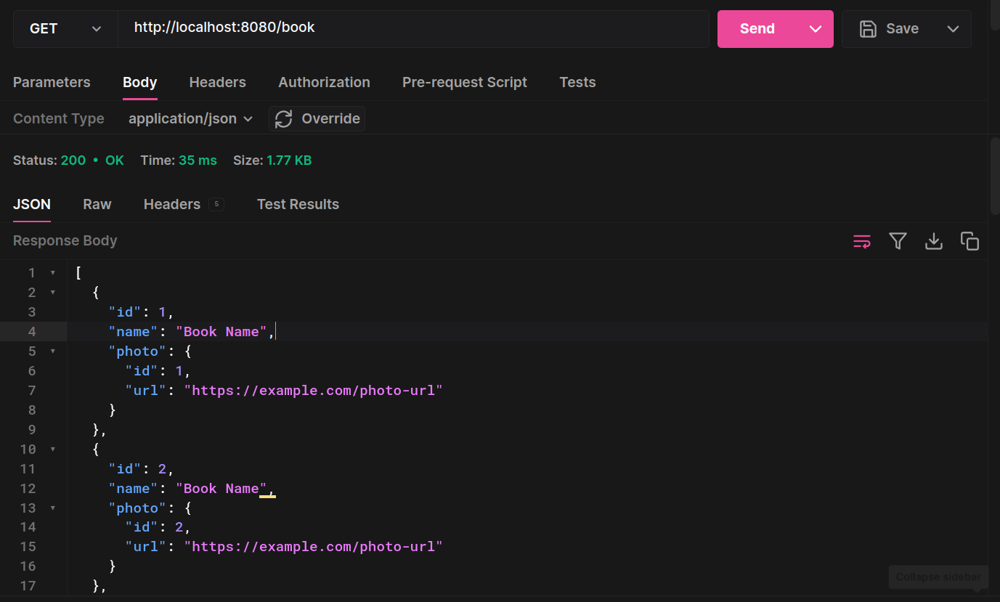

## @JoinColumn
Properties of @JoinColumn
Now let's analyze the properties provided by @JoinColumn:

- **name:** Indicates the name with which the column should be created in the table.
- **referencedColumnName:** Used to indicate which column the join will be performed on in the other table. It is generally not used, as JPA assumes that the column is the ID of the target entity.
- **unique:** Creates a constraint in the table to prevent duplicate values (default false).
- nullable: Creates a constraint in the table to prevent null values (default true).
- insertable: Indicates to JPA whether this value should be saved during the insertion operation (default true).
- updatable: Indicates to JPA whether the value should be updated during the update process (default true).
- columnDefinition: This property is used to indicate the SQL statement that should be used to create the column in the database. It helps us define exactly how the column will be created without depending on the JPA configuration.
- table: Specifies the table on which the join should be performed. It is usually not used, as JPA assumes the table based on the target entity.
- foreignKey: Indicates to JPA whether to create the foreign key. This property receives one of the following values: CONSTRAINT, NO_CONSTRAINT, PROVIDER_DEFAULT, defined in the javax.persistence.ForeignKey enumeration.

## @OneToOne

```java
@Entity
@Table(name = "book")
@Data
@NoArgsConstructor
public class Book {
   @Id
   @GeneratedValue(strategy = GenerationType.AUTO)
   @Column(name = "book_id")
   private Long id ;
   private String name;
   @OneToOne(cascade = CascadeType.ALL)
   @JoinColumn(name = "fk_photo_id")
   //@JsonIgnore
   private Photo photo;
}
```
```java
@Entity
@Data
@NoArgsConstructor
@Table(name = "photo")
public class Photo {
    @Id
    @GeneratedValue(strategy = GenerationType.IDENTITY)
    @Column(name = "photo_id")
    private Long id;
    private String url;
}
```
You'll get the `GET` request like this, with the `@Entity` `photo` inside `book`:



If want the `@Entities` in their own `@GET` request you add `@OnetoOne(mappedBy = "table"`, you also need to add `@JsonIgnore` to avoid issues getting the data with the `@GetMapping`
```java
@Entity
@Data
@NoArgsConstructor
@Table(name = "photo")
public class Photo {
    @Id
    @GeneratedValue(strategy = GenerationType.IDENTITY)
    @Column(name = "photo_id")
    private Long id;
    private String url;
    
   @OneToOne(mappedBy = "photo")
   @JsonIgnore
   private Book book;
}
```


## [Accessing the association sides](https://stackoverflow.com/a/48681422/15445661)
The first one is related to how you will access the relationship. For a unidirectional association, you can navigate the association from one end only.

So, for a unidirectional `@ManyToOne` association, it means you can only access the relationship from the child side where the foreign key resides.

If you have a unidirectional `@OneToMany` association, it means you can only access the relationship from the parent side which manages the foreign key.

For the bidirectional `@OneToMany` association, you can navigate the association in both ways, either from the parent or from the child side.

You also need to use [add/remove utility methods for bidirectional associations to make sure that both sides are properly synchronized.](https://vladmihalcea.com/a-beginners-guide-to-jpa-and-hibernate-cascade-types/)

Performance
The second aspect is related to performance.

- For @OneToMany, [unidirectional associations don't perform as well as bidirectional ones.](https://vladmihalcea.com/the-best-way-to-map-a-onetomany-association-with-jpa-and-hibernate/)
- For @OneToOne, a [bidirectional association will cause the parent to be fetched eagerly if Hibernate cannot tell whether the Proxy should be assigned or a null value.](https://vladmihalcea.com/2016/07/26/the-best-way-to-map-a-onetoone-relationship-with-jpa-and-hibernate/)
- For @ManyToMany, [the collection type makes quite a difference as Sets perform better than Lists.](https://vladmihalcea.com/the-best-way-to-use-the-manytomany-annotation-with-jpa-and-hibernate/)

## [CrudRepository vs JpaRepository](https://stackoverflow.com/a/14025100/15445661)

Because of the inheritance mentioned , `JpaRepository` will have all the functions of `CrudRepository` and `PagingAndSortingRepository`.
So if you don't need the repository to have the functions provided by `JpaRepository` and `PagingAndSortingRepository` , use `CrudRepository`.
And if you use `findAll`, `JpaRepository` will return a `List` (that be sorted if you want) instead of an `Iterable` an `Iterable` may not be a `List`.
The reason (I guess) why it returns a list it's because it's easy to manage `Paging`.

## Notes:
- Don't use `@Setter` & `@Getter` for relationships, cause issue like getting a double post method.

## Spring Boot 3 con Swagger (última versión)

1. Agregar las siguientes dependencias al proyecto: https://mvnrepository.com/artifact/or...

- Nota: A algunos no les funciona con la versión 2.0.3, pueden probar con la versión 2.0.4: https://mvnrepository.com/artifact/or...

- Esta es para evitar el error:
jakarta.validation.NoProviderFoundException: Unable to create a Configuration, because no Jakarta Bean Validation provider could be found.https://mvnrepository.com/artifact/or...

2. Ejecutar e ir a:
   http://localhost:8080/swagger-ui/index.html

3. Probar Swagger